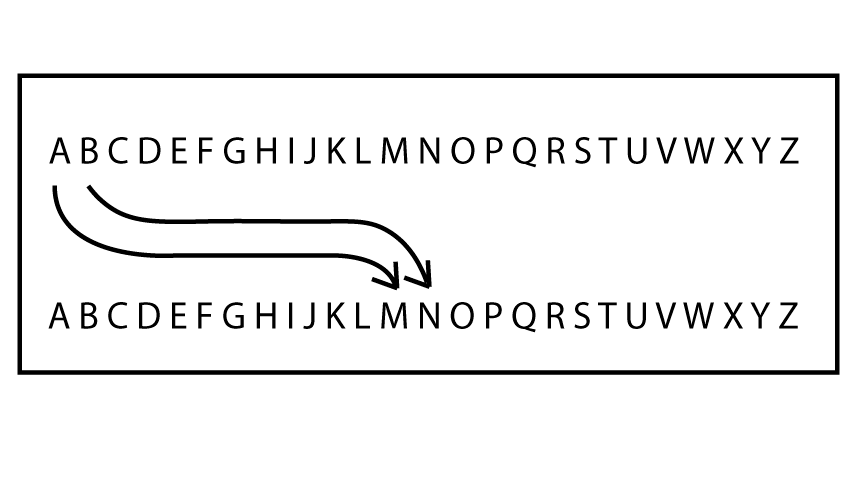
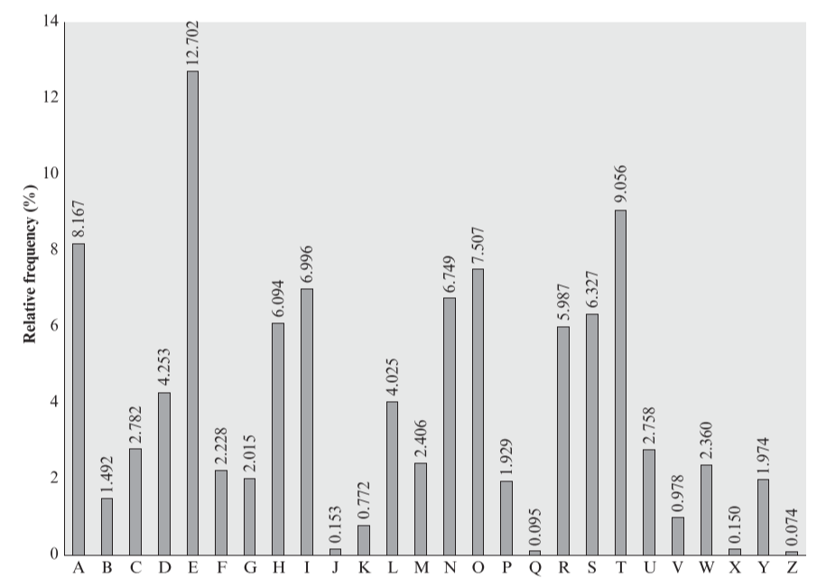

Title: Our secret messages: Caesar Cypher
Date: 2022-08-30
Modified: 2021-04-16
Category: Cypher
Tags: Python,Cypher
Slug: caesar_cypher
author: Mauricio Cuello
Summary: The ciphers are the base of our security in the internet but not just the internet, in the ancient world already were the need to pass secret messages. This article is a short explanation of Caesar cypher.
Save_as: caesar_cypher.html
status: published
keywords: cypher,python,programming

Let's talk about encryption, that useful thing that we know many devices work with but seems complicated. Many centuries ago, humanity noted the necessity of transmitting messages where only the intended receiver should know the content.

## Introduction

A genius but terrible man created one of the first encryption methods, the Caesar cipher. Julius Caesar sent his messages with shifts in the alphabet. This cipher has the characteristic of being symmetric, meaning that both the receiver and transmitter need to know the password or key to access the secret. The key in this cipher is the number of letter shifts applied to every letter in the message. To be clearer, here's an example with Python code:

### Application

Our message will be "alphabets" and the number of shifts will be 12. With these conditions, the letter "A" will become the letter "M" and so on. The encrypted message is "mxbtmnqfe".



The concept is simple, but it's more interesting to express this cipher in the language of nature: mathematics. To begin this process, we convert the letters into numbers using a reference, in this case, the English alphabet with 26 characters. For the sake of the code, the initial number is 0, not 1.

After converting to numbers, we add the shift (in this case, 12) to every letter in the message.


Notice that some numbers are larger than the maximum length of the alphabet, so we use a mathematical operation called modulo. The characteristic of this operation is the circular shift, meaning that when we reach the maximum length plus one, it restarts the count, so 26 becomes 0. The message then continues like this:


Finally, we translate the numbers back to letters.

### Code

 The following code illustrates the cipher:

```python
letters = ["a,b,c,d,e,f,g,h,i,j,k,l,m,n,o,p,q,r,s,t,u,v,w,x,y,z"]

word = input("Enter word: ")
word_numbers = []
cypher_numbers = []
precypher_numbers = []
cypher_text = []
shift = 12

letters = letters[0].split(",")

for i in range(0,len(word)):
    for j in range(0,len(letters)):
        
        if (word[i] == letters[j]):
            word_numbers.append(j)

for i in range(0,len(word_numbers)):
    precypher_numbers.append(word_numbers[i]+shift)
    cypher_numbers.append((word_numbers[i]+shift)%26)

print(f"Numbers of the word: {word_numbers}")
print(f"Precypher: {precypher_numbers}")
print(f"Cypher numbers: {cypher_numbers}")
            
cypher_text = [letters[i] for i in cypher_numbers]

print(f"Cypher text: {cypher_text}")
```

### Breaking the cypher

Among the ways to break a cipher, there are two that are very interesting in this case: the analytical way and the brute force attack. For the analytical way, there is a graph that illustrates the probability of letters in English vocabulary. With this data, it's possible to decipher a message by taking into account the association between letters by probability. 



Probability of each letter: Relative frequency (%) vs Letters. Taken from Cryptography and Network Security - William Stallings

If there is enough ciphertext to analyze, it's possible to deduce the key or the number of letter shifts. This can be done by counting the most common letter on average and assuming it's an "e", then the second most common letter on average and assuming it's a "t", and so on. After this process, the message can be deciphered.

The other method is the brute force approach, which consists of testing all possible keys within the cipher message. This method is used when it's possible to try many combinations at high speed, and a processor can do this very easily.