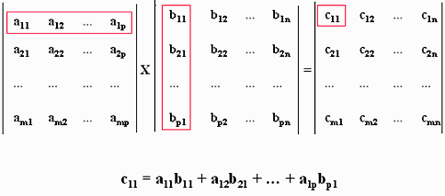

Title: Our secret messages: Hill Cipher
Date: 2022-10-28
Modified: 2024-10-30
Category: Cypher
Tags: python,cypher
Slug: hill_cipher
Authors: Mauricio Cuello
Summary: hill_cipher
Save_as: hill_cipher.html
status: published
keywords: hill_cipher.html

"Digital freedom stops where that of users begins... Nowadays, digital evolution must no longer be offered to a customer in trade-off between privacy and security. Privacy is not for sale, it's a valuable asset to protect"

Stephane Nappo

We meet again, like another casual meeting in a cafe to talk about a cipher method called the Hill Cipher.This method was created by the mathematician Lester Hill in 1929.

To begin this journey, we need some tools to fully understand this cipher, and we can say that the toolbox is linear algebra. In case you know some linear algebra, you could skip this segment.

### Tools

**Determinant:** is a number that characterizes a matrix and is calculated with the following equation:

$$
A = \begin{bmatrix} k_{11} & k_{12} \\ k_{21} & k_{22}\end{bmatrix}
\
\det(A) = (k_{11} \cdot k_{22}) - (k_{21} \cdot k_{12})
$$

**Inverse matrix:**  The inverse of a matrix does not always exist, but when it does, it's possible to satisfy the equation.

This matrix is special because it ensures that we can reconstruct the plaintext from the ciphertext by performing matrix operations.

**Matrix product:**

 Each element in the first row of  matrix A must multiplicate with each element in the first column of matrix  B to obtain the correct result, and so on to obtain all the result matrix. The product between matrices obeys the following equation:
$$
[A^{-1}] = {det(A)}^{-1} * (-1)^{i+j} *(D_{ij})
$$

Equation of inverse matriz by  cofactors matrix

- Where $D_{ij}$ is the subdeterminant formed by deleting the jth row and the ith column of matrix A
- Where $det(A)^{-1}$ is the multiplicative inverse of $det(A) mod 26$

The product between matrix  obey the equation on the right. Each element in the first row of  matrix A must multiplicate with each element in the first column of matrix  B to obtain the correct result, and so on to obtain all the result matrix.

The complete explanation of linear algebra is not the focus of this text, and with this previous tools is enough to understand the cipher.

## Cipher

So as not to lose the tradition, the cipher will be explained showing the process, conditions and results, the implementation will be done with a python code. Let´s start preparing the plaintext for the process, first is imperative to translate the letters into numbers, then the key matrix and last multiplicate to code the message.

For beginning let´s quote a book  "This encryption algorithm takes *m* successive plaintext letters and substitutes for them *m*  ciphertext letters. The substitution is determined by *m*  linear equations[...]"[1]  

The value of *m* depends on the length of the key and that´s the first step. We have to choose a key which it length has to be a square number like 4,9,16, etc...  This because the key matrix must be an square matrix.   In the python code for ease, if the length of the key  selected by the user is not a square number then it  complete it with enough z´s.

If we choose the key "srfn" then the number are 18,17,5,13 and reorganized in a matriz then is

$$
K = \begin{pmatrix} 18 & 17 \ 5 & 13 \end{pmatrix} \
\det(K) = 149
$$

Then we apply the following equation a we have the ciphertext:

$$
C = (P*K)mod26
$$

$$
P = \begin{pmatrix} 18 & 4 \ 4 & 13\end{pmatrix} \\
C = \begin{pmatrix} 18 & 4 \ 4 & 13\end{pmatrix} \cdot \begin{pmatrix} 18 & 17 \ 5 & 13\end{pmatrix} = \begin{bmatrix} 344 & 358 \\ 137 & 237\end{bmatrix} \mod 26
$$

where C is the ciphertext matrix and P is the plaintext matrix ( is obtain like the key matrix explain above).  

But I wish life were so simple, there are two  crucial considerations about the key matrix that at first glance it is not taken into account . The first one is the particular way of the matrix product and combine with the second one, the modular operation with matrix, complicated things.

Piece by piece like Jack the ripper, we need a linear equation and has to be reversible because the receptor want to decrypt the message. For that exists the inverse operation of every operation, that finally is a inverse number, something like:

$$
4*2 = 8 \\ 2 = 8* (1/4)
$$

Conclution, we can return the operation to obtain one of the factors, that is exactly what we want with this cipher but because the process is with matrix then the inverse matrix must be calculated with the process explained in the tools section.  After all this still exists a problem, some inverse matrix are useless in this cypher because the module operation is a circular operation. Let´s think in this, if I want to return a operation the result have to be unique and in the set of real numbers the condition is met, but with the module operation the result is not unique.

$$
(26)mod26 = 0 \\ (52)mod26 = 0
$$

To reverse the cipher taking into account the previously explained, the determinant of the key matrix have to meet the following condition:

$$
(det(A)*i)mod26 = 1
$$

This is the core of the problem, the determinant of the matrix multiply by some number *i* and all this module 26  must give one. The number *i* is the modular inverse of the matrix and confirm if the key matrix is valid, this condition apparently is easy to accomplish but can be really annoying. After all this is possible to encript the message, for the example the message "seen" is encrypted with the following process:

$$
P = \begin{pmatrix} 18 & 4 \ 4 & 13\end{pmatrix} \
C = \begin{pmatrix} 18 & 4 \ 4 & 13\end{pmatrix} \cdot \begin{pmatrix} 18 & 17 \ 5 & 13\end{pmatrix} = \begin{pmatrix} 344 & 358 \ 137 & 237\end{pmatrix} \mod 26
$$

$$
C = \begin{bmatrix}  6 & 20 \\ 7 &3\end{bmatrix}
$$

Finally encrypted message is "xuhd". If the process was correct then the message can be descripted.

## Decrypt

$$
K^{-1} =( \begin{bmatrix} 18 & 17 \\ 5 & 13\end{bmatrix}^{-1} * det\begin{bmatrix} 18 & 17 \\ 5 & 13\end{bmatrix} * 11)  mod26 = \begin{bmatrix} 13 & 21 \\ 23 & 16\end{bmatrix}
$$

Probably you are really confuse about this inverse matrix $K^{-1}$, so let me explain it. The first part

is the common inverse matrix calculate by the method explained in the tools section, then is multiplicated by the determinant of the key matrix, and then multiplicate all that by the number '11'  which is  the modular inverse and it allow to avoid the problem of modular operation, lastly is the module 26 operation .  This process has to be done because the characteristics of the operation module, but that is related to a topic beyond this text  called *fields .*

$$
P = (C \cdot K^{-1}) \mod 26 \\
P = \begin{pmatrix} 6 & 20 \\ 7 & 3 \end{pmatrix} \cdot \begin{pmatrix} 13 & 21 \\ 23 & 16 \end{pmatrix} \mod 26 \\
P = \begin{pmatrix} 538 & 446 \\ 160 & 195 \end{pmatrix} \mod 26 = \begin{pmatrix} 18 & 4 \\ 4 & 13 \end{pmatrix}
$$
